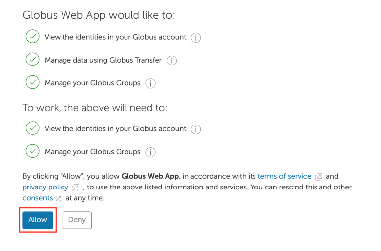
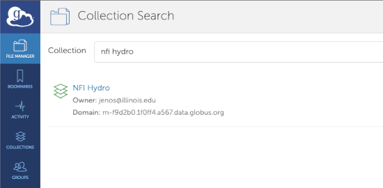
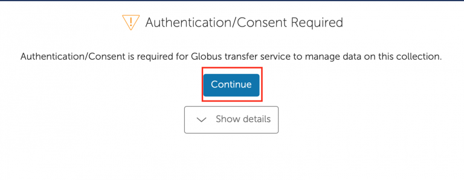
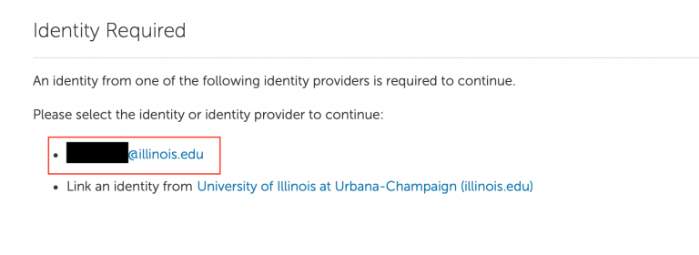
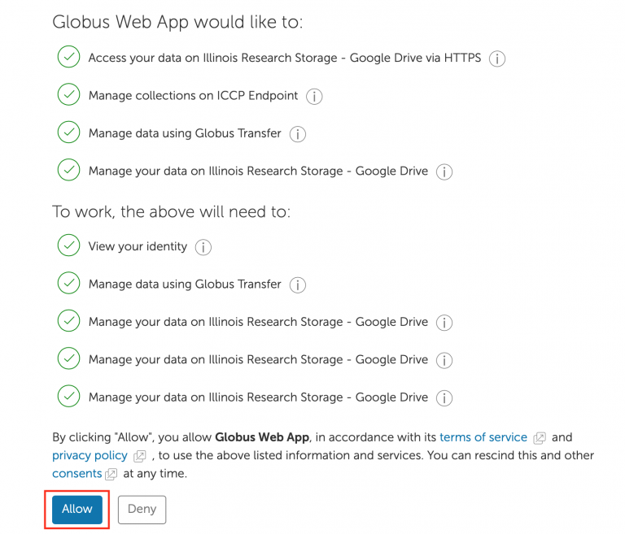
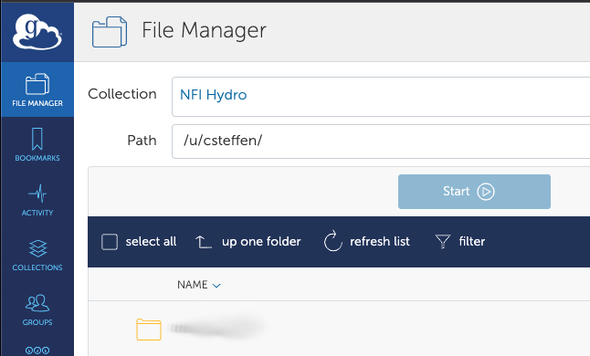
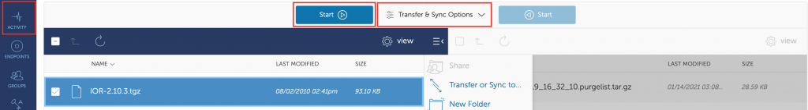

.. _transferring-files:

Accessing and Transferring Files to and from Hydro
====================================================

.. _small-transfer-tools:

Transferring a Few Small Files With Text Tools
-------------------------------------------------

These tools are suitable for a few (typically less than 1000) files and in total less than 100 GB.  If your transfers using these tools take more than 15 minutes, please consider using Globus instead.  

If you use a Windows machine, you can transfer files back and forth between your machine and Hydro using an application called "WinSCP".  You'll have to download it and install it.  When open WinSCP, you'll need to log into the Hydro login node as your "remote" node, using your username, password, and 2FA as usual.  Once you've logged in, WinSCP will work like a drag and drop interface for moving files.  

The program Secure CoPy (SCP) can be used to securely transfer files between Hydro and other systems.  SCP is built into all Mac and most Windows computers.  You can find tutorials online for using scp.  The important thing you need to know is the full pathname of the file(s) that you're wanting to move on the machine where they're coming from, *and* the full pathname of where you want the files to go.

As an example, you want to move a file called "my_input_file.dat" from your local computer to Hydro.  You want to put it in a directory on Hydro which is "/u/hirop/input_files".  First, open a terminal or command prompt.  Change directories to where the file is, so that if you run the "ls" command, the file you want to transfer is listed.  

:: 

   $ cd outgoing_data
   $ ls
   my_input_file.dat
   
Now securely copy the file to Hydro using the following command: 

:: 

   scp ./my_input_file.dat hirop@hydro.ncsa.illinois.edu:/u/hirop/input_files/

The output will prompt you for your kerberos password, ask you to initiate a 2FA confirmation (or else ask for a passcode).  If you authentication is successful, it will transfer the file, printing out progress as it does so.

.. _globus:

Transferring Many or Large Files With Globus
---------------------------------------------

Globus is a web-based file transfer system that works in the background to move files between systems with "Globus Endpoints".  Hydro's Globus endpoint is called "ncsa#BlueWaters".  To transfer files to and from your directories using Globus, you will have to authenticate that endpoint, using your  NCSA username, password, and NCSA account on Duo. 

One-time Setup
~~~~~~~~~~~~~~~~

You will need to set up a separate account on globus.org, that will have a username and a separate password.  To use Globus to transfer files to and from Hydro, if you haven't already, you will need to "link" your new Globus account with your NCSA identity.  Log into globus.org, click on "Account" in the left sidebar, then click on the "Identities" tab.  If your NCSA username and email address is not in that list, then click "Link Another Identity" in the upper right to link it.

Using Globus to Transfer Files
~~~~~~~~~~~~~~~~~~~~~~~~~~~~~~~~~~~

Once your identity is linked (above) then do the following to transfer files using Globus.

Navigate to globus.org and cling “Log In” in the upper right corner

Choose “National Center for Supercomputing Applications” as your Identity Provider and click “Continue”

.. image:: 

If prompted click “Allow” when asked to authorized the Globus Web App

Login in via the Illinois Shibboleth service, this will be a Duo 2FA prompt

..
   Once logged in you should be taken to the File Manager section, on one side search for "BlueWaters" collection and you should see a list of endpoints, click on the “ncsa#BlueWaters” endpoint

Once in the file manager section, click on "collection".  Search for "NFI Hydro" and click on the "NFI#Hydro" collection.

.. 
   this will be a link to the endpoint, which we don't know the name of yet.
    .. image::

The system will prompt you to Authenticate to the endpoint, click continue; Globus may prompt you to link your netid@illinois.edu identity, go ahead and do so

You should then get dropped back into the “File Manger” view and be able to see your home directory in the explorer window

Then in a similar manner (in the right half of the “File Manger” view) search for and authenticate to the collection you are planning to transfer data to/from, then use the GUI to transfer the data; you can choose transfer settings. Also on the left is a button to view your current transfer activity

